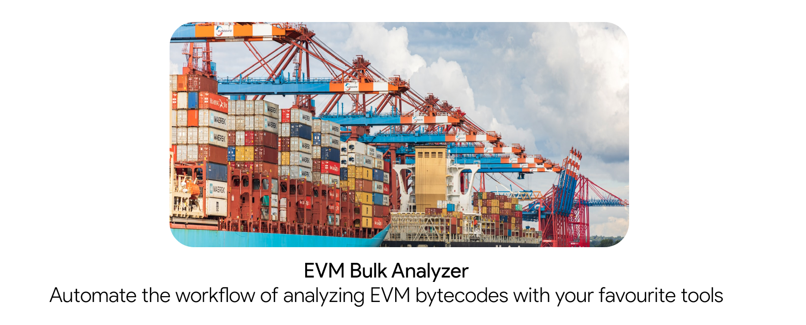

  </img>

## Project status: Work in progress
We do not recommend to use this tool in any production related scenario. It still under development, and its not widely tested.

## Requirements

* Docker installed and properly configured.

## Latest release

[**Download**](../../releases)

## Contributing

Everybody is welcome to contribute to the project. Please check out the [**Contribution Steps**](CONTRIBUTING.md) for instructions about how to proceed.
  
And any other comments will be very appreciate.

## License

All rights reserved to project author(s)

Redistribution and use in source and binary forms, with or without modification, are permitted provided that the following conditions are met:

 * Redistributions of source code must retain the above copyright notice, this list of conditions and the following disclaimer.
 * Redistributions in binary form must reproduce the above copyright notice, this list of conditions and the following disclaimer in the documentation and/or other materials provided with the distribution.
 * Uses GPL license described below

This program is free software: you can redistribute it and/or modify it under the terms of the GNU General Public License as published by the Free Software Foundation, either version 3 of the License, or (at your option) any later version.

See [**LICENSE**](LICENSE) file for full license details.
